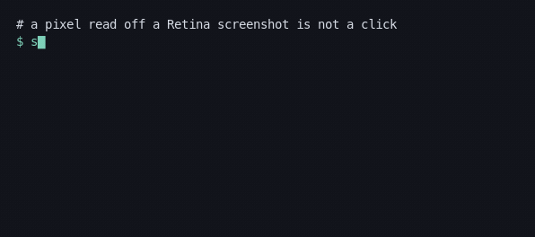
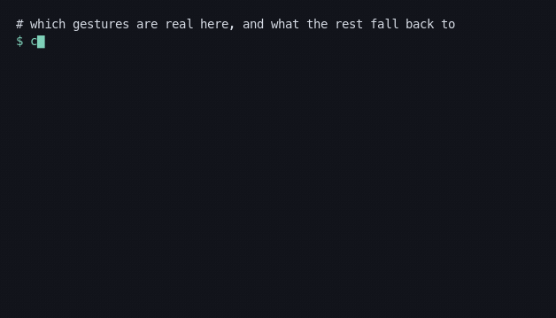
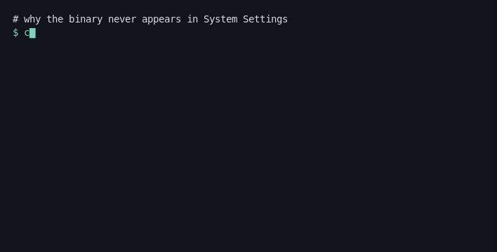

# computer-control

[](https://github.com/minhnd410/computer-control/actions/workflows/ci.yml)
[](LICENSE)


**An MCP server for driving a desktop — and the phones on it.** macOS, Windows and Linux, plus iOS simulators, Android emulators and mirrored handsets, on a single C++20 core.

One binary. Point an MCP client at it and the model gets 32 tools — capture,
pointer, keyboard, multi-touch, windows, accessibility tree, phones.

```json
{ "mcpServers": { "computer-control": { "command": "computer-control-mcp" } } }
```

```bash
computer-control-mcp --request-permissions   # grant what it needs, then report
computer-control-mcp --doctor                # why is nothing happening?
computer-control-mcp --list-tools
```

---

## Contents

- [Why this exists](#why-this-exists)
- [What it can do](#what-it-can-do)
  - [Gesture fidelity by platform](#gesture-fidelity-by-platform)
  - [What has actually been tested](#what-has-actually-been-tested)
- [Install](#install)
- [Use as an MCP server](docs/mcp.md)
- [Permissions](docs/permissions.md)
- [Driving phones and simulators](docs/devices.md)
- [Claude Code in WSL](docs/wsl.md)
- [Using the library directly](#using-the-library-directly)
- [Safety](#safety)
- [Contributing](#contributing) · [Project layout](#project-layout)
- [Full documentation index](#documentation)

---

## Why this exists

Desktop automation tools tend to pick one platform, one language, and one level of abstraction. This one makes three specific bets.

### Coordinate spaces are part of the type system

The single most common bug in this space is reading a pixel off a Retina screenshot and clicking it as if it were a point. Every coordinate here carries a space — `logical`, `physical`, or `image` — and conversion resolves against the display that contains it, so mixed-DPI multi-monitor setups convert per display rather than with one global factor.



### Fidelity is reported, not faked

Windows and Linux can synthesize genuine multi-touch. macOS cannot — there is no public API for it. Instead of silently substituting something that looks similar, `capabilities` tells you whether each gesture is `native`, `emulated`, or `unsupported`, names the backend, and explains the substitution. `require_native` refuses emulation outright.



### Errors carry a remedy

Every failure names the exact next step — the settings pane, the package, the udev rule. The macOS permission model in particular is genuinely confusing: a grant belongs to the *responsible process*, so a CLI started from a terminal is attributed to the terminal, never appears in System Settings, and cannot prompt for itself. The tool says so rather than returning an empty result.



The server speaks the current revision, **2026-07-28**, and falls back to **2025-06-18** for clients that have not caught up — which today is most of them. A modern request is served statelessly with no handshake; an `initialize` still works. See [protocol revisions](docs/mcp.md#protocol-revisions).

---

## What it can do

| Area | Capabilities |
|---|---|
| **Pointer** | move, click (single/double/triple/hover), five buttons, modifier-clicks, press/release, scroll (line and pixel-precise, phased), drag-and-drop with correct press/settle timing |
| **Paths** | freehand strokes with optional Catmull-Rom smoothing, per-point pressure and dwell, pen routing where supported |
| **Motion** | `instant`, `linear`, `ease`, and `human` (jitter + overshoot-and-settle), seedable for reproducible paths |
| **Keyboard** | chords (`cmd+shift+a`), sequences (`cmd+k cmd+s`), hold-for-duration, explicit down/up, layout-independent Unicode (emoji, CJK) |
| **Gestures** | tap, n-finger swipe/pan, pinch, rotate, smart zoom, long press, force press, edge swipe — up to 10 contacts |
| **System** | launcher, search, app switcher, overview, desktop switching, notifications, capture UI, emoji, run dialog, settings, file manager, lock |
| **Capture** | full desktop, per-display, per-window, per-region; PNG and JPEG encoded in-process; automatic downscaling to a payload budget |
| **Windows** | list, activate, move, resize, minimise/maximise/fullscreen, close; fuzzy title matching |
| **Accessibility** | full element tree with numbered labels, element-at-point, focused element, invoke/toggle/set-value |
| **System services** | clipboard, process list/kill, shell, notifications, Windows registry |
| **Mobile** | discovery, boot/shutdown, tap/swipe/stroke/gesture, text, hardware buttons, screenshots, install/launch/terminate, deep links, device UI tree |
| **Permissions** | functional probe, request, and the responsible-process diagnosis |

### Gesture fidelity by platform

| Gesture | Windows | Linux | macOS |
|---|---|---|---|
| Tap, long press | native | native (uinput) / emulated | native |
| 2-finger swipe, pan | native | native (uinput) / emulated | **native** (phased scroll) |
| 3–5 finger swipe | shell shortcuts | native (uinput) | shell shortcuts |
| Pinch / zoom | native | native (uinput) / emulated | emulated (`cmd`+scroll) |
| Rotate | native | native (uinput) | **unsupported** |
| Force press | native | native (uinput) | emulated (long press) |

- **Windows** uses `InjectTouchInput` for real contacts, up to 10. But a **multi-finger *trackpad* swipe cannot be synthesized at all**: Windows interprets those in the Precision Touchpad driver from HID reports, and injected contacts are *touchscreen* input that goes to the window underneath. Those route to the shortcuts that driver invokes instead — four fingers switch virtual desktops, three switch apps.
- **Linux** creates a virtual multitouch touchscreen via `/dev/uinput`, which works on Wayland as well as X11. Without write access it falls back to XTest emulation.
- **macOS** has no public multi-touch synthesis. Two-finger swipe and pan are genuinely native because `CGEvent` exposes trackpad scroll phases; pinch maps to `cmd`+scroll; rotation has no honest equivalent and is refused.

The `capabilities` tool gives the live answer on any machine; `computer-control-mcp --doctor` prints the same report without a client. For shell-level effects prefer the [`system`](docs/mcp.md) tool — it is both the reliable path and the fast one.

### What has actually been tested

Maintainer-tested:

| OS | Version | Tested by | Exercised |
|---|---|---|---|
| macOS | 26.6 (Tahoe), Apple silicon | maintainer | capture, pointer, clicks, drag, stroke, gestures, accessibility tree, permissions, launcher, search, shell, simulator discovery |
| Linux | Debian 12 under Xvfb | maintainer, **in the Docker image that has since been removed** | capture, pointer, clicks, Unicode typing, chords, emulated gestures, permission reporting |
| Windows | 11 | maintainer, **before the current code** | see below |

Compiled and unit-tested on every push: macOS (arm64 + x86_64), Windows (MSVC), Linux (gcc + clang, under Xvfb).

**Windows needs a re-test.** The two behaviours that were checked there — running a PowerShell script, and multi-finger trackpad swipes — both turned out to be broken, and both were rewritten. PowerShell now goes through `-EncodedCommand` because the old quoting mangled any script containing a double quote; multi-finger swipes now map to shell shortcuts because touch injection cannot produce a touchpad gesture at all. Neither rewrite has been run on Windows. If you have a Windows machine, this is the single most useful thing to try.

**Not yet exercised by anyone:** the Windows backend since the rewrites above, the Linux `/dev/uinput` native-gesture path (needs a host with a writable uinput device), macOS on Intel, any BSD, and every non-Debian distribution.

**Partially verified:** on macOS, `system --action overview` and the desktop-switching actions deliver their shortcuts correctly, but no effect was observable in a capture on the test machine, so they are not claimed as working. `system` reports what it *sent*, never what the OS did with it.

**Please help.** If you run this anywhere not in that table — another Windows build, a KDE or Wayland session, an Intel Mac, a Raspberry Pi, a physical Android phone over scrcpy — [open an issue](https://github.com/minhnd410/computer-control/issues) with the output of `computer-control-mcp --doctor`. That is a genuinely useful contribution even if you change no code, and it is how the table above grows. See [CONTRIBUTING](CONTRIBUTING.md).

---

## Install

Download the archive for your platform from
[Releases](https://github.com/minhnd410/computer-control/releases), or build
it. Details: **[docs/install.md](docs/install.md)**.

```bash
# macOS (Apple silicon) — see the docs for other platforms and checksum verification
curl -fsSLO https://github.com/minhnd410/computer-control/releases/latest/download/computer-control-macos-arm64.tar.gz
tar -xzf computer-control-macos-arm64.tar.gz
sudo mv computer-control/computer-control-mcp /usr/local/bin/
computer-control-mcp --request-permissions

# or from source
cmake -S . -B build -DCMAKE_BUILD_TYPE=Release && cmake --build build -j
```

> **Coming soon, not available:** Homebrew, winget, `uvx`, and `curl | sh`. The
> scaffolding is in [`packaging/`](packaging); nothing is published to a tap,
> a manifest repository or an index yet. The release archives are also
> unsigned — on macOS that means Gatekeeper quarantine, and an Accessibility
> grant that does not survive an upgrade.

**Claude Code in WSL:** install the **Windows** build and have WSL launch it. A Linux binary inside WSL cannot control Windows — WSLg is one-directional. See [docs/wsl.md](docs/wsl.md).

---

## Using the library directly

```cpp
#include <cc/session.hpp>

auto session = cc::Session::create().value();
auto input = session->input().value();

input->click(cc::Point{640, 480}, cc::ClickOptions{.count = 2});

cc::GestureRequest pinch;
pinch.kind = cc::GestureKind::Pinch;
pinch.center = cc::Point{700, 400};
pinch.scale = 2.0;
input->gesture(pinch);
```

`Session` owns the backends and guarantees that everything held — mouse buttons, modifier keys, touch contacts — is released when it is destroyed, including on an exception path.

There is no C ABI and no Python binding. To drive this from another language, speak MCP to the server, or build the `cc` CLI from source (`cmake --build build --target cc_cli`) and parse `--raw` JSON — it is byte-for-byte what the matching MCP tool returns. `cc` is a debugging and scripting tool for contributors; it is not shipped in the release archives, because it mirrors the same action registry and adds no capability.

---

## Safety

This library can do anything the user in front of the machine can do.

- `--no-shell` removes command execution; `--tools` restricts the surface to exactly what you list; registry writes need `--allow-registry`.
- Bind HTTP to loopback. Binding elsewhere without `CC_AUTH_TOKEN` prints a warning — anything that can reach the port controls the machine.
- Every held button, key and touch contact is released on shutdown, including on the error path, so an interrupted drag never leaves the desktop stuck. `release_all` recovers manually.
- No telemetry, no analytics, no network access beyond what a tool call explicitly performs.

**Never commit screenshots.** They routinely contain password managers, private messages and customer data; `.gitignore` excludes images by default. [SECURITY.md](SECURITY.md) has the threat model.

---

## Project layout

```
include/cc/        Public C++ headers
src/core/          Platform-independent: coordinate math, motion and gesture
                   geometry, JSON, PNG/JPEG codecs, deflate, UTF-8
src/platform/      macos/ (CGEvent, ScreenCaptureKit, AX)
                   windows/ (SendInput, InjectTouchInput, UIA, GDI)
                   linux/ (XTest, uinput, EWMH, AT-SPI2)
src/devices/       Simulator, emulator and mirrored-device transports
src/actions/       The shared action dispatcher: JSON in, JSON out
src/mcp/           MCP server — the binary that ships
src/cli/           `cc`, the same dispatcher behind argv; contributors only
packaging/         Homebrew formula, winget manifests, install script (none published)
```

Both front-ends funnel through one action dispatcher (`src/actions/actions.cpp`), so the CLI and the MCP server cannot drift apart. Adding a capability is one `ActionSpec` there.

---

## Contributing

Contributions are very welcome, and **testing on hardware I do not have is the most useful kind**. See [CONTRIBUTING.md](CONTRIBUTING.md); [CLAUDE.md](CLAUDE.md) documents the architecture and the invariants that break subtly.

```bash
cmake -S . -B build -DCMAKE_BUILD_TYPE=Debug
cmake --build build -j && ctest --test-dir build --output-on-failure
```

---

## Documentation

| | |
|---|---|
| [Install](docs/install.md) | Release archives, building from source, what is not published yet. |
| [MCP server](docs/mcp.md) | Client config, transports, tool gating. |
| [Permissions](docs/permissions.md) | Per-platform grants, and the macOS responsible-process problem. |
| [Devices](docs/devices.md) | iOS simulators, Android emulators, mirrored handsets. |
| [WSL](docs/wsl.md) | Why the server must run on the Windows side. |
| [Coordinate spaces](docs/coordinate-spaces.md) | Logical vs physical vs image, mixed DPI, device points. |
| [JSON schema](docs/json-schema.md) | Every JSON payload the MCP tools return. |
| [Tool comparison](docs/tool-comparison.md) | What came from Windows-MCP and macOS-MCP, and what did not. |
| [tools/make_demo_gif.py](tools/make_demo_gif.py) | Regenerates the GIFs above from real command output. |

---

## Prior art

The tool surface is a superset of [Windows-MCP](https://github.com/CursorTouch/Windows-MCP) and [macOS-MCP](https://github.com/CursorTouch/MacOS-MCP), both MIT-licensed and worth reading. This project differs in being a single C++ core across three desktop platforms with an explicit coordinate-space model, honest fidelity reporting, and mobile-device support.

## License

MIT — see [LICENSE](LICENSE).
